# Todo Manager:

A full CRUD based Spring MVC application with user authentication and role-based
access control.
User with role admin has additional privilege to manage users and update all Todos.

Unit test and Integration Test have been done utilizing JUnit and Mockito.

# **ER Diagram:**

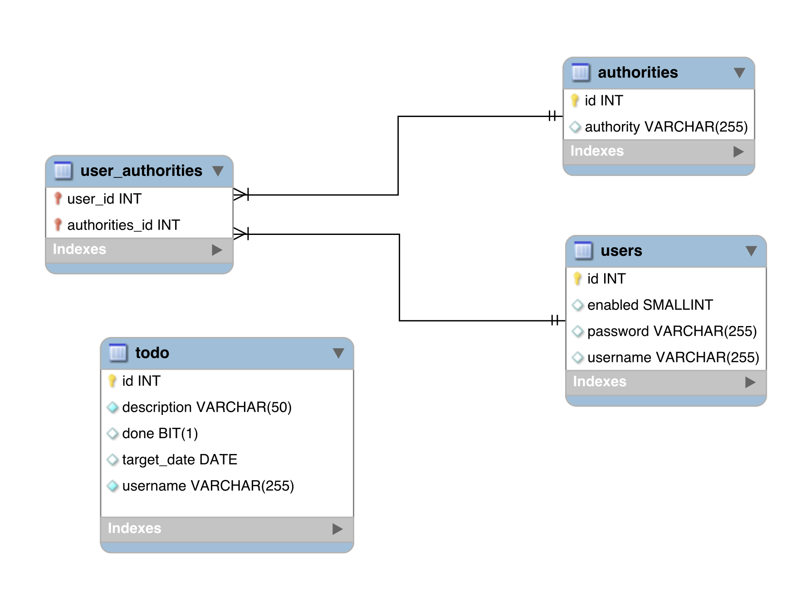

# Snapshots:

## **Todo Controller:**

### Login Page:

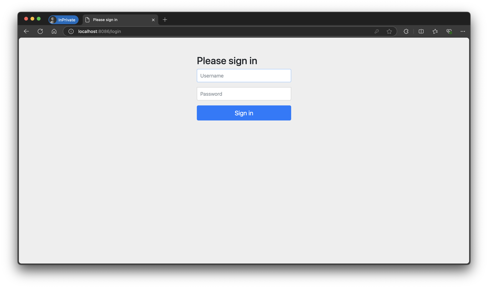

### Homepage for Employee:

User with Employee role only has access to add, update and delete Todos.
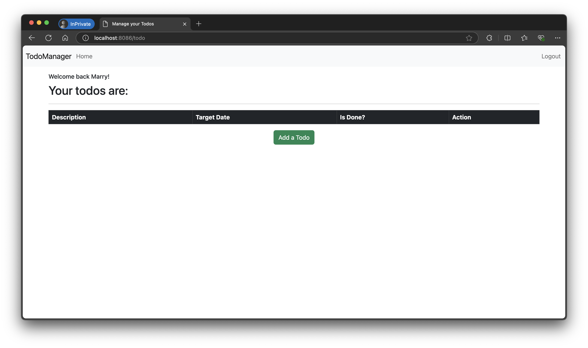

### Add Todo:

User need to submit this form to add a new Todo.
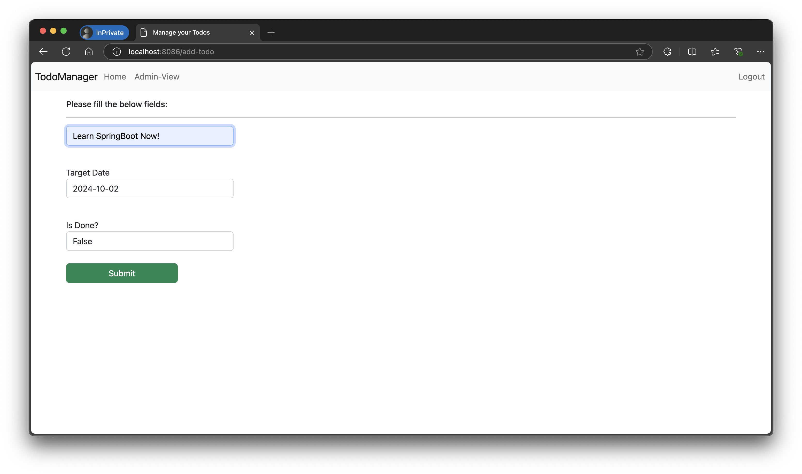

### After Adding Todo:

List of incomplete Todos. (Todos marked as done will not be listed. Also,
by default Todos are listed in ascending order of Target Date)
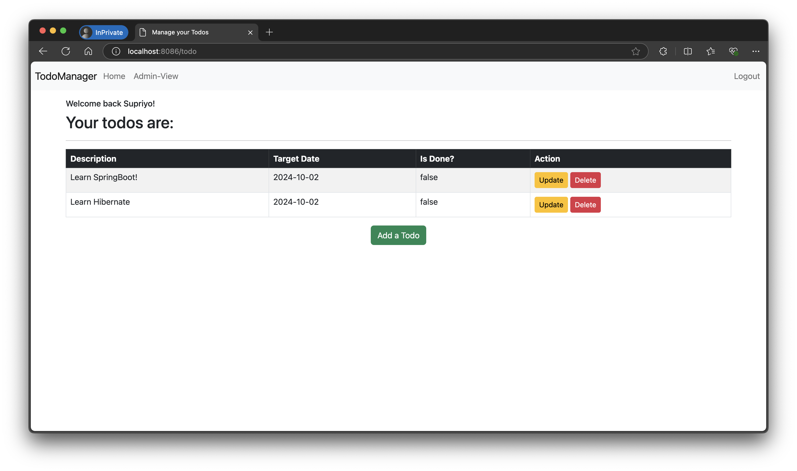

### After updating Todo:

Updated the description of the first Todo to demonstrate the update
functionality.
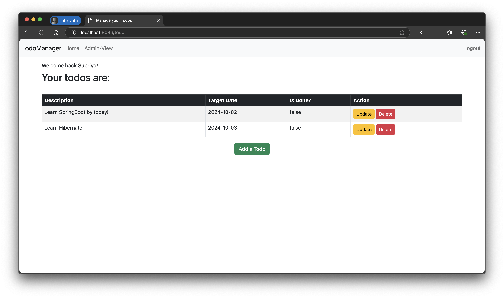

### After deleting todo:

Deleted the first Todo to demonstrate the delete functionality.
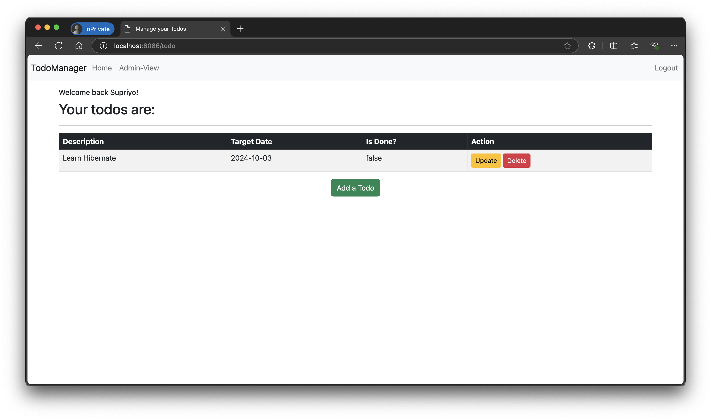

## Admin Controller:

### Homepage for Admin:

Admin user has special "Admin-View" link-button which provide additional
features
like- list all the Todos respective of any users, add/ delete a user
and assign Todo to any existing users.
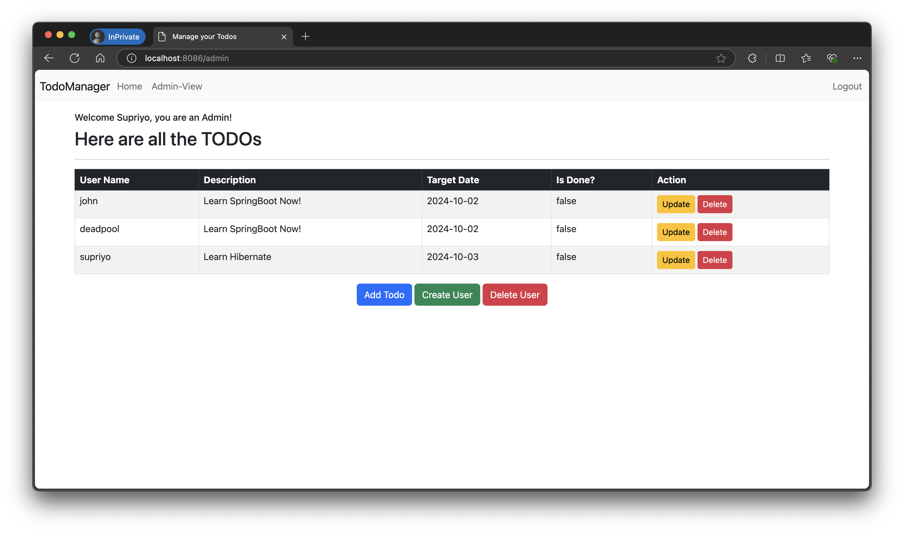

### Add new user:

By submitting this form, Admin can create new a user.
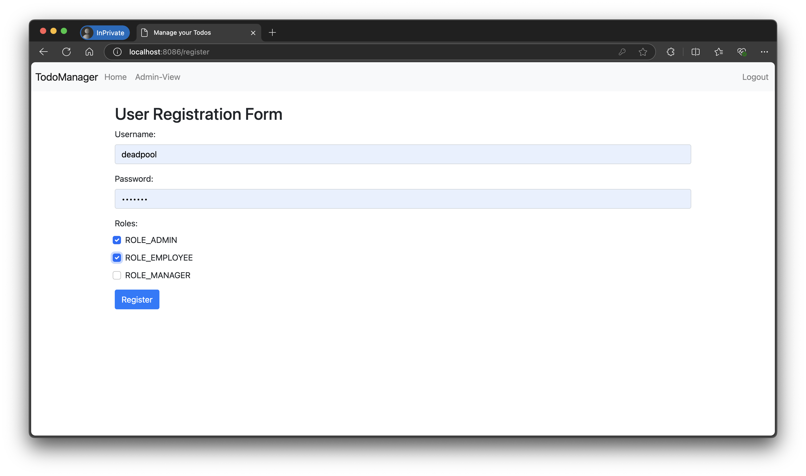

### Add Todo for a user as admin:

Admin can add a Todo for any existing users by choosing the username from
the dropdown list.
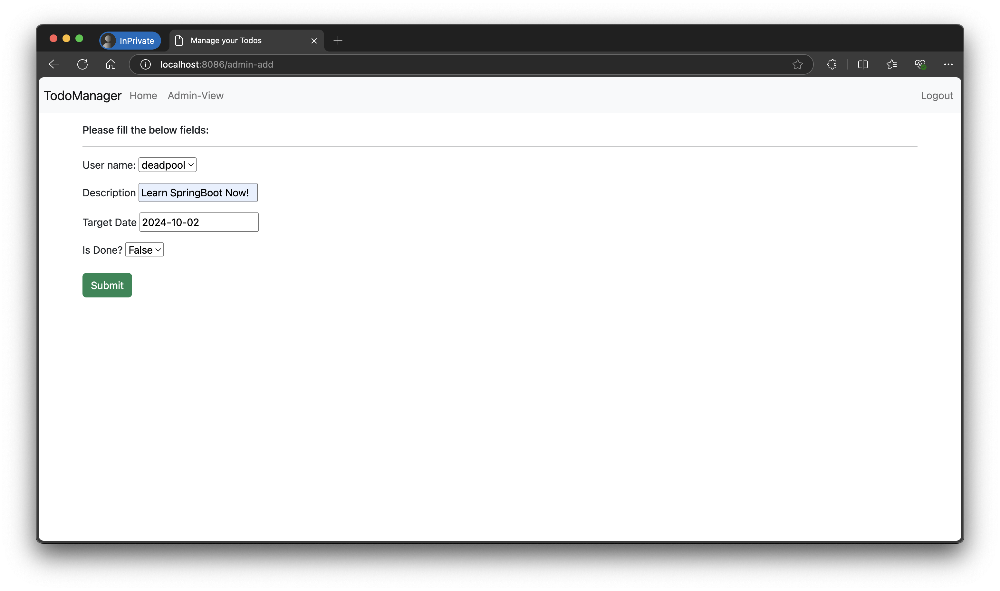

### Delete a user:

To delete a user admin need to select the username from the dropdown and hit
submit.
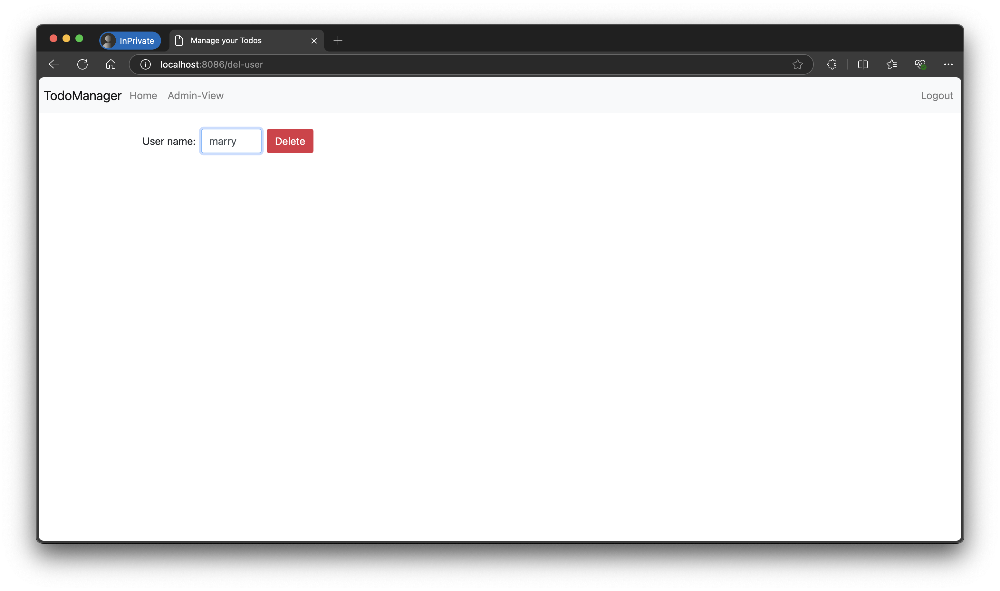

